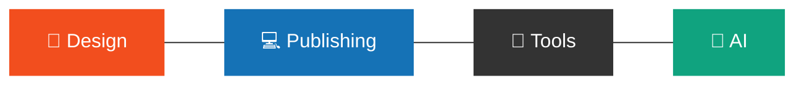
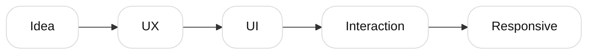

<div align="center">

# LEE DONG HWA ✨

UI/UX Designer · Web Designer

미니멀한 구조 속 인터랙션을 설계합니다.

<br>

</div>

---

# 🛠 Skills



<div align="center">

Figma · Photoshop · Illustrator · HTML · CSS · JavaScript

</div>

---

# ✨ Process



---

# 🚀 Projects

### 🔊 Sound Notification App
청각장애인을 위한 소리 알림 서비스

### 📻 Pingpong Radio
감성 기반 인터랙션 라디오 플랫폼

### 💖 Yumi's Cells Landing Page
드라마 컨셉 인터랙티브 랜딩페이지

---

# 🌱 Current Focus

```txt
Responsive Web
Motion Interaction
Creative UI
AI Workflow
```

---

# 📊 GitHub

<div align="center">


</div>

---

# 📫 Connect

<div align="center">

<a href="https://github.com/YOUR_GITHUB_ID">

</a>

<a href="https://www.notion.so/">

</a>

<a href="mailto:your@email.com">

</a>

</div>
