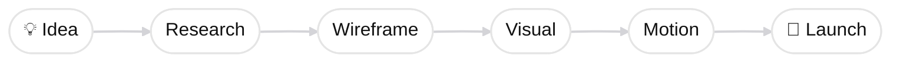

<div align="center">

  

UI/UX Designer · Web Designer

미니멀한 구조 속 인터랙션을 설계합니다.

<br>

</div>

<div align="center">

# 📫 Connect
[](https://discord.gg/https://discord.gg/XQJWtjcGx) [](https://x.com/leedonghaw0427) [](mailto:leedonghaw0427@gmail.com) 

</div>

---

<div align="center">

# 🛠 Skills

<table>
<tr>
<td align="center">

### 🎨 Design


</td>

<td align="center">

### 💻 Publishing


</td>
</tr>

<tr>
<td align="center">

### 🧰 Tools


</td>

<td align="center">

### 🤖 AI Workflow


</td>
</tr>
</table>

</div>

---

# ✨ Workflow



---

# 🚀 Projects

<div align="center">

<table>
<tr>

<td width="33%">

### 📻 Pingpong Radio

감성과 음악이 연결되는  
인터랙션 라디오 플랫폼


`Figma` `Illustrator` `Photoshop`

</td>

<td width="33%">

### 💖 Yumi's Cells

감정 기반 인터랙티브  
랜딩페이지 디자인


`Figma` `Photoshop`

</td>

<td width="33%">

### 🔔 Guide Me

청각장애인을 위한  
실시간 소리 알림 서비스


`Figma` `HTML` `CSS` `JavaScript`

</td>

</tr>
</table>

<br>

<table>
<tr>

<td width="33%">

### 🍨 Haagen-Dazs

브랜드 프로모션  
상세페이지 디자인


`Photoshop` `Illustrator`

</td>

<td width="33%">

### 🍱 한식진흥원

전통 식문화 UX/UI  
리디자인 프로젝트

`Figma`

</td>

<td width="33%">

### 🎨 Medicube

브랜드 비주얼 기반  
에디토리얼 디자인


`Illustrator` `Photoshop`

</td>

</tr>
</table>

</div>

---

# 🌱 Current Focus

```txt
Motion UI  
Interactive Experience  
Responsive Web  
AI Workflow
```

---

# 📊 GitHub Stats:
<br/>
<br/>


---
[](https://visitcount.itsvg.in)

<!-- Proudly created with GPRM ( https://gprm.itsvg.in ) -->
